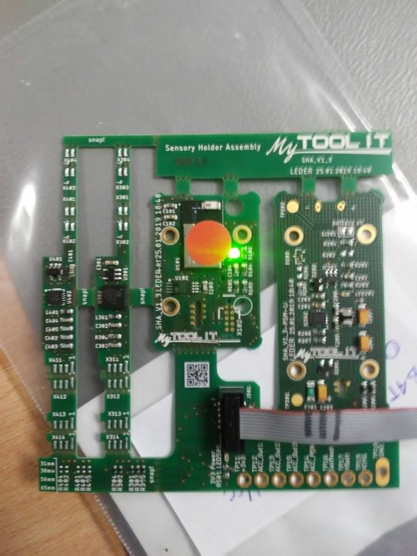

# Vorbereitung

Damit der Test für eine STH oder STU durchgeführt werden kann benötigt man diverse Hardware- und Software-Komponenten. Der nächste Teil des Texts beschreibt als erstes das Hardware-Setup und dann die Installation der benötigten Software.

## Hardware


1. PC aufbauen und Peripherie (Maus, Tastatur, Bildschirm) anschließen
2. ESD-Matte aufbauen und anschließen
3. Stromversorgung für STU einrichten

   - Power-Injector (24V) (oder selten für 5V: Micro-USB)

   

4. PEAK-CAN-Adapter an USB-Port anschließen
5. Programming-Board an USB-Port anschließen
6. Je nachdem ob man eine SHA/STH oder STU testen will unterscheidet sich welche Einheit man am Debug-Adapter des Programming-Boards anstecken muss:

   

   - **STH-Test**: Debug-Adapter von Programming-Board (mittels Adapter Cable) **mit SHA/STH verbinden**

     

   - **STU-Test**: Debug-Adapter von Programming-Board (mittels Adapter Cable) **mit STU verbinden**

     

## Software

1. Windows 10 installieren

2. [Python (`3.9+`)](https://www.python.org/downloads/) installieren

   - Nicht vergessen **„Add Python to Path“** zu selektieren

3. [Simplicity Studio](https://www.silabs.com/products/development-tools/software/simplicity-studio) installieren (Simplicity Commander wird benötigt)

4. [PEAK-System-Gerätetreiber für Windows](https://www.peak-system.com/PCAN-USB-FD.365.0.html) installieren

5. [ICOc installieren](https://mytoolit.github.io/ICOc/#install):

   ```sh
   pip install icoc
   ```

6. Im `Documents`-Ordner (des aktuellen Benutzers) einen neuen Unter-Ordner namens `Firmware` erstellen und das [aktuelle STH-Binary](https://github.com/MyTooliT/STH/releases) (.hex) dort speichern.

7. Im vorher erstellten `Firmware`-Ordner ebenfalls das [aktuelle STU-Binary](https://github.com/MyTooliT/STU/releases) (.hex) speichern.

8. Nach diesen Schritten sollte die Ordner-Struktur in etwa so aussehen:

   ```
   Documents
   └── Firmware
       ├── manufacturingImageSthv2.1.10.hex
       └── manufacturingImageStuv2.1.10.hex
   ```

9. Nachdem die Software-Komponenten nur erfolgreich installiert und eingerichtet wurden kann man mit

   - dem [STH-Test](#sth-test) oder
   - dem [STU-Test](#stu-test)

   fortfahren.
